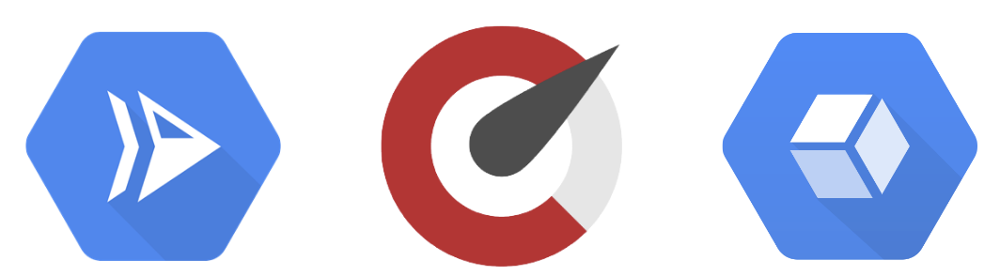

# Overview



The goal of this example is to show debugging (tracing and metrics) on Cloud Run application (Node.js) with Stackdriver using OpenCensus.

[Google Cloud Run](https://cloud.google.com/run/) is a fully managed platform that takes a Docker container image and runs it as a stateless, autoscaling HTTP service.

## Prerequisites
Install [Node.js](https://nodejs.org) in your local development environment.
Create a Google Cloud Platform (GCP) project and set it as your default project
with the command
```sh
$ export GOOGLE_CLOUD_PROJECT=[your project id]
$ gcloud config set project $GOOGLE_CLOUD_PROJECT
```

You will need the environment variable GOOGLE_CLOUD_PROJECT exported to the Node.js runtime for it to send the data to Stackdriver when running in a local development environment.

Enable the [Stackdriver API](https://cloud.google.com/monitoring/api/v3/) with the command
```sh
$ gcloud services enable monitoring
```

You can run the example with another monitoring backend if you modify the code in `server.js` to use a different exporter.

## Install dependencies and run the app
```sh
$ npm install
$ npm start
```

Navigate to <http://localhost:8080/wiki>:


### Stackdriver UI

Please visit <https://console.cloud.google.com/traces/traces>:


> Stackdriver Trace is a distributed tracing system that collects latency data from your applications and displays it in the Google Cloud Platform Console.

## Build the image
Now, build your container image using Cloud Build, by running the following command from the directory containing the `Dockerfile`:

```sh
$ gcloud builds submit --tag gcr.io/$PROJECT_ID/wiki-app
```

> Cloud Build is a service that executes your builds on GCP. It executes a series of build steps, where each build step is run in a Docker container to produce your application container (or other artifacts) and push it to Cloud Registry, all in one command.

### Running locally
If you would like to run and test the application locally from Cloud Shell, you can start it using this standard docker command :

```sh
$ docker run -d -p 8080:8080 gcr.io/$PROJECT_ID/wiki-app
```

## Deploy to Cloud Run
Deploying your containerized application to Cloud Run is done using the following command:

```sh
$ gcloud run deploy wiki-app \
  --image gcr.io/$PROJECT_ID/wiki-app \
  --platform managed \
  --region us-central1 \
  --allow-unauthenticated
```
The `--allow-unauthenticated` deploy option enables you to reach the application without authentication.

The `--platform managed` deploy option means that we're requesting the fully-managed environment.

Then wait a few moments until the deployment is complete.


## Time to clean up
While Cloud Run does not charge when the service is not in use, you might still be charged for storing the built container image.

You can either decide to delete your GCP project to avoid incurring charges, which will stop billing for all the resources used within that project, or simply delete your `wiki-app` image using this command :

```sh
$ gcloud container images delete gcr.io/$PROJECT_ID/wiki-app
```

To delete the Cloud Run service, use this command :

```sh
$ gcloud run services delete wiki-app \
  --platform managed \
  --region us-central1
```

## Important Note:

OpenCensus is being replaced by ***OpenTelemetry***, but the migration should not require much change to use of the API. Read more [here](https://medium.com/opentracing/a-roadmap-to-convergence-b074e5815289).
